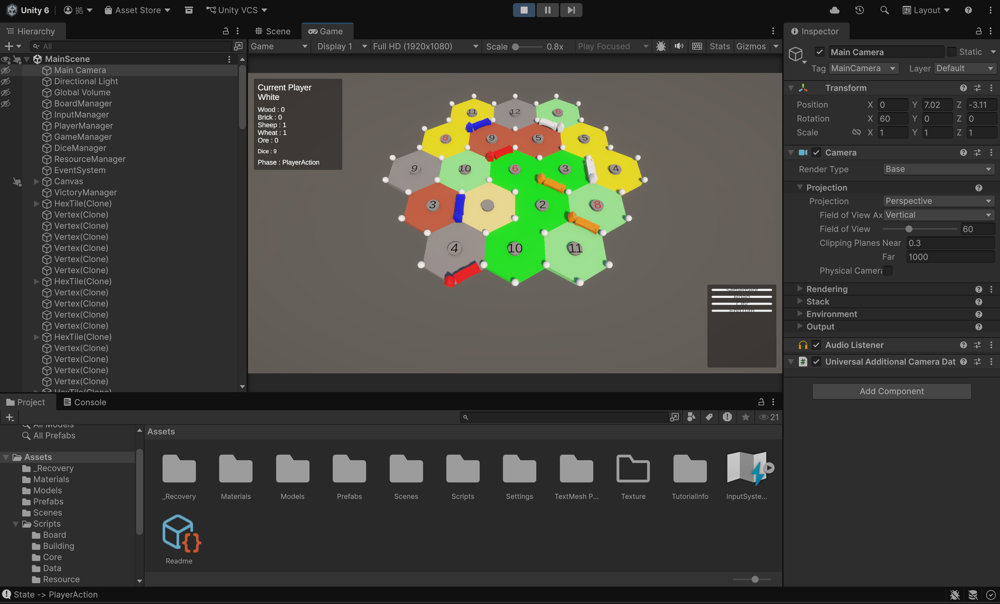

# Frontier Conquest 3D

**Unityで開発している3Dストラテジーボードゲーム**

ボードゲーム「カタン」をベースに、3D空間上の六角形グリッドを使ったゲームを制作しています。

基本的な資源・建設システムに加えて、将来的には**領地占領・戦闘・ミニゲーム**などの独自要素を追加し、オリジナルのストラテジーボードゲームへ発展させることを目指しています。

ゲーム制作を通して、ゲームルールを支えるプログラム設計や3Dゲーム開発について学習・実践しています。

---

## 🎮 Game Overview

プレイヤーが六角形の土地を開拓し、

* 資源を獲得
* 開拓地を建設
* 街道を建設
* 開拓地を都市へアップグレード
* 勝利点を獲得

しながらゲームを進めるストラテジーボードゲームです。

### 基本ゲームループ

```text
ゲーム開始
    ↓
初期配置
    ↓
サイコロを振る
    ↓
資源獲得
    ↓
建設・交換などのアクション
    ↓
ターン終了
    ↓
次のプレイヤー
```

---

## 📱 / 🖥️ Game Screen

### 現在の開発画面

<p align="center">
  
</p>

現在は、基本的な盤面・初期配置・ターン進行・資源獲得・建設システムを中心に開発しています。

---

## 🎮 Current Features

### Gameplay

* [x] 初期配置フェーズ
* [x] ターン制進行
* [x] サイコロによる資源配布
* [x] 開拓地建設
* [x] 街道建設
* [x] 開拓地から都市へのアップグレード

### Rule System

* [x] 建設可能判定
* [x] 道路接続判定
* [x] 建物の隣接禁止判定
* [x] 初期配置ルール
* [x] プレイヤーごとの資源管理

### System

* [x] GameStateによるゲーム状態管理
* [x] PlayerManagerによるターン管理
* [x] ResourceManagerによる資源管理
* [x] グラフ構造による盤面管理
* [x] プレイヤー切り替え

### 3D Assets

* [x] Blenderによるオリジナルモデル制作
* [x] BlenderからUnityへのモデル導入
* [x] Unity Prefabによるオブジェクト管理

---

## 🧠 Game Design

### カタンをベースにしたゲームシステム

基本的な資源獲得・建設というゲームループをベースにしながら、将来的には独自のゲームシステムを追加する予定です。

```text
資源獲得
   ↓
建設・拡張
   ↓
領地を拡大
   ↓
他プレイヤーと競争
   ↓
勝利条件を目指す
```

今後は、単純な建設だけではなく、

* 領地占領
* プレイヤー同士の戦闘
* 戦闘用ミニゲーム
* AIプレイヤー

などを追加し、より戦略性のあるゲームへ発展させる予定です。

---

# 🏗️ Architecture

## Graph Structure

本作では、六角形の盤面を**グラフ構造**として設計しています。

六角形タイルそのものだけで盤面を管理するのではなく、

* `HexTile` = タイル
* `Vertex` = 建物を建設できる交点
* `Edge` = 街道を建設できる辺

として、それぞれの接続関係を保持しています。

```text
HexBoard
 │
 ├── HexTile
 │
 ├── Vertex
 │     └── Building
 │          ├── Settlement
 │          └── City
 │
 └── Edge
       └── Road
```

この構造によって、

* 建設可能判定
* 建物の隣接判定
* 道路接続判定
* 資源配布判定

などのゲームルールを、盤面上の接続関係を利用して実装しています。

---

## 🧩 Responsibility Separation

各クラスが異なる責務を持つように設計しています。

### GameManager

ゲーム全体の状態遷移を管理します。

```text
InitialSettlement
        ↓
InitialRoad
        ↓
RollDice
        ↓
PlayerAction
        ↓
EndTurn
        ↓
RollDice
```

---

### PlayerManager

プレイヤーに関する処理を担当します。

* 現在のプレイヤー管理
* ターン切り替え
* プレイヤー情報管理

---

### HexTile

六角形の地形タイルを管理します。

保持情報：

* `resourceType`
* `numberToken`
* `adjacentVertices`

---

### Vertex

タイル同士の交点を管理します。

担当機能：

* 開拓地建設
* 都市建設
* 隣接判定
* 建設可能判定

---

### Edge

交点同士を結ぶ辺を管理します。

担当機能：

* 街道建設
* 接続判定
* 道路ネットワーク管理

---

### ResourceManager

プレイヤーが所持する資源を管理します。

* 資源の獲得
* 資源の消費
* 資源量の管理

---

## 🔄 State Management

ゲーム進行はState Machineを利用して管理しています。

```text
┌──────────────────────┐
│ InitialSettlement    │
└──────────┬───────────┘
           ↓
┌──────────────────────┐
│ InitialRoad          │
└──────────┬───────────┘
           ↓
┌──────────────────────┐
│ RollDice              │
└──────────┬───────────┘
           ↓
┌──────────────────────┐
│ PlayerAction          │
└──────────┬───────────┘
           ↓
┌──────────────────────┐
│ EndTurn               │
└──────────┬───────────┘
           │
           └────────→ RollDice
```

ゲーム状態に応じて、プレイヤーが操作できるオブジェクトや実行可能な処理を制御しています。

これにより、例えば初期配置中に通常ターン用の処理が実行されるといった、**ゲーム状態によるルールの破綻を防ぐ**ことを意識しています。

---

# 🎨 3D Modeling

ゲーム内で使用する3Dモデルの一部をBlenderで制作しています。

```text
Blender
   ↓
3D Model
   ↓
FBX Export
   ↓
Unity
   ↓
Prefab
   ↓
Game Object
```

六角形タイルや建物などのゲームオブジェクトを自作し、Unity上でPrefabとして管理しています。

---

# 🛠️ Technologies

| Category         | Technology             |
| ---------------- | ---------------------- |
| Engine           | Unity 6                |
| Language         | C#                     |
| 3D Modeling      | Blender                |
| IDE              | Visual Studio Code     |
| Version Control  | Git / GitHub           |
| Architecture     | Object-Oriented Design |
| Board Structure  | Graph Structure        |
| State Management | State Machine          |

---

# 💡 What I Learned

この制作を通して、ゲーム制作では「ゲームが動くこと」だけではなく、**機能追加やルール変更を考えた設計が重要であること**を学びました。

特に、ゲームルールを一つのManagerに集中させるのではなく、盤面を構成するオブジェクト自身に関連する責務を持たせることを意識しました。

例えば、

```text
Vertex
→ 建設可能か判定する

Edge
→ 道路を接続できるか判定する

GameManager
→ 現在のゲーム状態を管理する

PlayerManager
→ 現在のプレイヤーを管理する
```

というように役割を分けています。

この設計によって、ゲームルールを追加・変更する際にも、関連するクラスを中心に修正できる構造を目指しています。

---

## 📚 Skills

### Programming

* オブジェクト指向設計
* State Machine
* グラフ構造
* ゲームルール実装
* プレイヤー・ターン管理
* 接続関係を利用した判定処理

### Unity

* Scene / GameObject管理
* Prefab
* Layer
* Raycast
* Script設計
* 3Dオブジェクト操作

### 3D Production

* Blenderモデリング
* FBXエクスポート
* Unityへのモデル導入
* Prefab化

### Development

* Git
* GitHub
* ブランチを利用した開発
* デバッグ・動作確認

---

# 🚀 Future Plans

## Phase 1

**基本的なゲームシステムの完成**

* [x] 勝利点
* [ ] 資源交換
* [ ] 都市システムの拡張

## Phase 2

**戦略要素の追加**

* [ ] 発展カード
* [ ] 港システム
* [ ] 最大街道

## Phase 3

**オリジナルゲームシステムの追加**

* [ ] 領地占領システム
* [ ] 戦闘システム
* [ ] 戦闘ミニゲーム
* [ ] AIプレイヤー

## Phase 4

**ゲームとしての完成度向上**

* [ ] Save / Load
* [ ] AI強化
* [ ] オンライン対戦
* [ ] UI / UX改善

---

# 📈 Development Status

**🚧 開発中**

現在は、ゲームの基本となる

**盤面生成 → 初期配置 → ターン進行 → 資源獲得 → 建設**

までのシステムを中心に実装しています。

今後は基本ルールを完成させた上で、領地占領・戦闘・ミニゲームなどの独自要素を追加し、オリジナルの3Dストラテジーボードゲームとして完成させる予定です。

---

# 👤 Author

**Individual Project**

### Roles

* Game Planning
* Game Design
* Programming
* 3D Modeling
* Unity Development

本作品では、企画・ゲームルール設計・プログラミング・3Dモデリングまで個人で担当しています。
